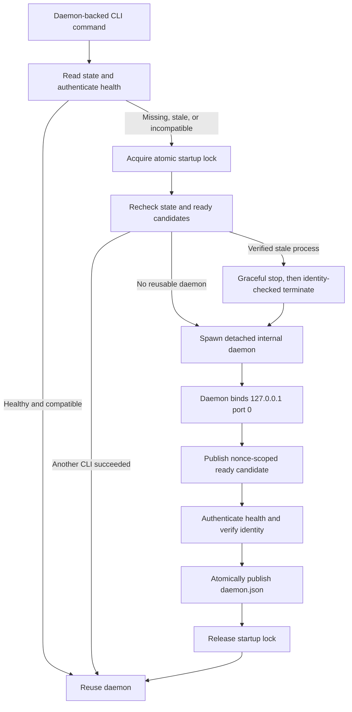

# Agentic Debug Mode Implementation Plan

> **For agentic workers:** implement tasks in dependency order with a failing-test-first cycle. Do not create commits unless the user explicitly requests them.

**Goal:** Ship a standalone `debug-mode` binary and `agentic-debug-mode` skill that collect, query, and present session-isolated runtime evidence without exposing daemon internals to agents.

**Architecture:** A Bun CLI talks to one authenticated, user-scoped daemon over loopback. All persistent local state lives under `~/.agent-debug-mode/`; Rust provides embedded jaq evaluation and cross-platform process identity primitives through N-API. Every daemon-backed command calls one idempotent supervisor that either reuses the verified daemon or performs a locked, race-safe recovery/start sequence.

**Tech stack:** Bun + TypeScript, `Bun.serve`, Rust + `napi-rs` + `jaq-core`/`jaq-std`/`jaq-json`, NDJSON, npm optional platform packages, Homebrew, GitHub Actions.

## Global constraints

- Treat [docs/building-a-debug-mode-agent.md](docs/building-a-debug-mode-agent.md) as the product contract; update contradictions before implementing affected behavior.
- Resolve one state root with `os.homedir()`: `~/.agent-debug-mode/` on every supported OS. Do not place state in repositories, XDG directories, Application Support, or LocalAppData.
- Pretty output is primary for `logs`, `query`, and `status`; `--json` is the versioned automation contract.
- The agent never receives raw evidence paths, ports, control tokens, or daemon process details.
- Bind only `127.0.0.1` on an OS-assigned port (`port: 0`); never probe fixed ports before binding.
- Never kill a PID based only on `daemon.json`; forced termination requires an atomic native identity recheck.
- A Unix zombie cannot be killed: reap it if this CLI is its parent, otherwise remove only verified stale state and continue recovery.
- Direct-append probes write `incoming.ndjson`; only the daemon writes normalized `events.ndjson` with `id`, `sequence`, and `receivedAt`.
- The first release excludes the browser UI, SSE, active-session migration, and remote transports, but keeps boundaries compatible with them.

## Daemon lifecycle



- `ensureDaemon(): Promise<DaemonConnection>` is the sole startup/recovery entry point in [src/cli/daemon-manager.ts](src/cli/daemon-manager.ts).
- Resolve the single state root in [src/platform/state-root.ts](src/platform/state-root.ts) as `join(os.homedir(), \".agent-debug-mode\")` on macOS, Linux, and Windows. Tests inject a temporary home/state root; production commands never accept an arbitrary state path.
- Keep daemon ownership and session evidence together under that root:

```text
~/.agent-debug-mode/
├── daemon.json
├── control.token
├── startup.lock/
├── ready/
├── sessions/
│   └── <session-id>/
│       ├── session.json
│       ├── runs.json
│       ├── incoming.ndjson
│       ├── events.ndjson
│       └── diagnostics.ndjson
└── tmp/
```

- Create `control.token` atomically with cryptographic randomness and user-only permissions; send it as `Authorization: Bearer ...` and compare in constant time.
- Publish metadata with temp-file + flush + atomic rename. `daemon.json` records schema/protocol/binary versions, PID, native process-start identity, executable path, host, port, startup nonce, and start time.
- Serialize contenders with atomically created `startup.lock/`. Losers wait with bounded backoff while repeatedly checking authenticated health. A lock is breakable only when its recorded process identity is absent/mismatched and its startup deadline has expired.
- Spawn the current executable in hidden `__daemon` mode. The daemon binds port `0`, writes `ready/<nonce>.json`, and emits a one-line readiness handshake. The lock owner authenticates `/v1/control/health`, verifies nonce/PID/process identity, then publishes `daemon.json`. A later CLI may adopt a healthy candidate if the original launcher crashed before publication.
- On stale state, try authenticated drain/shutdown first. If health is unavailable, call a Rust `terminate_if_identity_matches` operation that rechecks PID + process start time + executable before signaling; use TERM/grace period/KILL on Unix and the equivalent bounded Windows termination. If identity cannot be proven, quarantine state and start on a new OS-assigned port without touching the unknown process.
- Protocol-compatible daemons are reused. An incompatible idle daemon is replaced through authenticated shutdown. An incompatible daemon with active sessions returns exit `3` and recovery guidance; it is never force-replaced.
- `stop --session` closes only that session. The daemon remains while another session is active and exits gracefully after the final session closes; `daemon stop` drains all accepted writes, atomically removes owned state, and exits. Signal handlers use the same drain path.

## Task 1: Bootstrap and native feasibility

**Files:** create [package.json](package.json), [tsconfig.json](tsconfig.json), [bunfig.toml](bunfig.toml), [Cargo.toml](Cargo.toml), [src/cli.ts](src/cli.ts), [native/query/Cargo.toml](native/query/Cargo.toml), [native/query/src/lib.rs](native/query/src/lib.rs), [native/system/Cargo.toml](native/system/Cargo.toml), [native/system/src/lib.rs](native/system/src/lib.rs), [scripts/build-native.ts](scripts/build-native.ts), [scripts/build-binary.ts](scripts/build-binary.ts), and [tests/distribution/native-smoke.test.ts](tests/distribution/native-smoke.test.ts); update [.gitignore](.gitignore).

- Prove a Bun-compiled executable can directly require both target-matched N-API addons and run without Bun installed.
- Expose a trivial jaq transform plus `inspect_process`/`terminate_if_identity_matches` stubs with typed TS wrappers.
- Add host-platform smoke tests before building daemon code; fail the milestone if single-binary embedding is not reproducible.

## Task 2: Freeze domain and output contracts

**Files:** create [src/domain/event.ts](src/domain/event.ts), [src/domain/session.ts](src/domain/session.ts), [src/domain/run.ts](src/domain/run.ts), [src/domain/diagnostic.ts](src/domain/diagnostic.ts), [src/cli/parse-args.ts](src/cli/parse-args.ts), [src/cli/dispatch.ts](src/cli/dispatch.ts), [src/cli/output-schema.ts](src/cli/output-schema.ts), [src/cli/pretty-renderer.ts](src/cli/pretty-renderer.ts), [src/cli/exit-codes.ts](src/cli/exit-codes.ts), and contract tests under [tests/contract](tests/contract).

- Implement `--version`, semantic exit codes, typed success/error envelopes, warning/statistics/hint ordering, and TTY-aware pretty rendering from the same result objects.
- Define immutable run hypothesis declarations and normalized event/diagnostic schemas.
- Test JSON snapshots and pretty-output invariants without daemon dependencies.

## Task 3: Implement atomic persistence and session/run isolation

**Files:** create [src/platform/state-root.ts](src/platform/state-root.ts), [src/platform/atomic-file.ts](src/platform/atomic-file.ts), [src/platform/permissions.ts](src/platform/permissions.ts), [src/daemon/persistence.ts](src/daemon/persistence.ts), [src/daemon/session-registry.ts](src/daemon/session-registry.ts), [src/daemon/run-registry.ts](src/daemon/run-registry.ts), [src/daemon/event-store.ts](src/daemon/event-store.ts), and unit tests under [tests/unit/persistence](tests/unit/persistence); update the state-layout contract in [docs/building-a-debug-mode-agent.md](docs/building-a-debug-mode-agent.md).

- Create `~/.agent-debug-mode/` with user-only permissions and persist daemon metadata, locks, ready candidates, temporary render/query buffers, `session.json`, `runs.json`, `incoming.ndjson`, `events.ndjson`, and `diagnostics.ndjson` only beneath it.
- Store the canonical workspace path inside `session.json`; never write runtime state into the workspace itself.
- Use atomic metadata replacement, restrictive permissions, append serialization, run-scoped clear semantics, and no global-latest fallback.
- Test interrupted writes, symlinks/path traversal, two-workspace isolation, immutable hypothesis sets, and clear racing with append.

## Task 4: Build the daemon supervisor first

**Files:** create [src/daemon/main.ts](src/daemon/main.ts), [src/daemon/server.ts](src/daemon/server.ts), [src/daemon/auth.ts](src/daemon/auth.ts), [src/daemon/protocol.ts](src/daemon/protocol.ts), [src/daemon/state-file.ts](src/daemon/state-file.ts), [src/daemon/startup-lock.ts](src/daemon/startup-lock.ts), [src/daemon/shutdown.ts](src/daemon/shutdown.ts), [src/cli/daemon-client.ts](src/cli/daemon-client.ts), [src/cli/daemon-manager.ts](src/cli/daemon-manager.ts), and integration tests under [tests/integration/daemon](tests/integration/daemon).

- Implement the lifecycle state machine above and authenticated `/v1/control/health`/shutdown routes before session creation.
- Stress 20+ simultaneous `start` processes and assert one PID/nonce/port; test launcher crash before readiness, crash after readiness before state publication, half-written state, stale lock owner, dead PID, PID reuse against a sentinel process, hung verified daemon, candidate adoption, and cleanup after startup failure.
- Simulate occupied ports and assert port `0` allocation/retry without fixed-port scanning. Cover macOS, Linux, and Windows process identity/termination behavior in CI.
- Verify compatible reuse, idle incompatible replacement, active incompatible refusal, two-session shutdown ordering, drain completion, SIGTERM cleanup, and that unverifiable processes are never signaled.

## Task 5: Add control APIs, ingestion, and canonicalization

**Files:** create [src/daemon/control-api.ts](src/daemon/control-api.ts), [src/daemon/ingest-api.ts](src/daemon/ingest-api.ts), [src/domain/event-validation.ts](src/domain/event-validation.ts), [src/domain/redaction.ts](src/domain/redaction.ts), [src/daemon/sequence.ts](src/daemon/sequence.ts), [src/daemon/diagnostic-store.ts](src/daemon/diagnostic-store.ts), [src/daemon/direct-append-observer.ts](src/daemon/direct-append-observer.ts), and command files under [src/cli/commands](src/cli/commands).

- Implement versioned control/session/run/clear routes and capability-gated `POST /v1/ingest/<capability>` with bounded JSON/NDJSON bodies, narrow CORS, secret rejection/redaction, immutable routing, and `202` responses.
- Normalize both HTTP and `incoming.ndjson` records through one validator/sequencer before appending canonical evidence; buffer incomplete trailing direct-append lines and record malformed/undeclared-hypothesis diagnostics.
- Test concurrent HTTP/direct ingestion, monotonic sequences, deduplication, clear races, malformed lines, capability/session mismatch, and control-token non-disclosure.

## Task 6: Deliver the useful CLI vertical slice

**Files:** create [src/cli/commands/start.ts](src/cli/commands/start.ts), [src/cli/commands/probe.ts](src/cli/commands/probe.ts), [src/cli/commands/logs.ts](src/cli/commands/logs.ts), [src/cli/commands/status.ts](src/cli/commands/status.ts), [src/cli/commands/clear.ts](src/cli/commands/clear.ts), [src/cli/commands/run-begin.ts](src/cli/commands/run-begin.ts), [src/cli/commands/sessions.ts](src/cli/commands/sessions.ts), [src/cli/commands/stop.ts](src/cli/commands/stop.ts), [src/evidence/log-service.ts](src/evidence/log-service.ts), [src/evidence/status-service.ts](src/evidence/status-service.ts), [src/evidence/snapshot.ts](src/evidence/snapshot.ts), [src/cli/render/table.ts](src/cli/render/table.ts), [src/cli/hints.ts](src/cli/hints.ts), [src/probes/renderers/typescript-http.ts](src/probes/renderers/typescript-http.ts), and tests under [tests/contract](tests/contract) and [tests/integration](tests/integration).

- Wire every daemon-backed command through `ensureDaemon`; no command performs ad hoc PID/port logic.
- Ship TypeScript HTTP probes first, balanced region markers, full-field token-efficient logs tables, status diagnostics, offset/limit snapshots, complete navigation hints, and JSON parity.
- Gate the first usable milestone on `start → probe → ingest → logs/status → clear/run begin → stop` across two concurrent sessions.

## Task 7: Implement Rust/jaq query and shape-aware rendering

**Files:** create [native/query/src/engine.rs](native/query/src/engine.rs), [native/query/src/input.rs](native/query/src/input.rs), [native/query/src/cursor.rs](native/query/src/cursor.rs), [native/query/src/diagnostics.rs](native/query/src/diagnostics.rs), Rust tests under [native/query/tests](native/query/tests), [src/query/native.ts](src/query/native.ts), [src/query/query-service.ts](src/query/query-service.ts), [src/cli/commands/query.ts](src/cli/commands/query.ts), and [tests/contract/query-rendering.test.ts](tests/contract/query-rendering.test.ts).

- Compile jaq once; stream ordinary programs; make slurp explicit; enforce cancellation/time/resource errors; authenticate cursors to session/run/program/snapshot; never expose source paths or host capabilities.
- Detect complete-page shape deterministically: homogeneous flat objects → table, scalar streams → indexed value table, otherwise numbered pretty JSON; preserve exact values in `--json`.
- Run compatibility, malformed input, zero/one/many output, regex, slurp, cancellation, cursor, redaction, and property-based security tests in Rust.

## Task 8: Expand probes and publish the skill

**Files:** add renderers under [src/probes/renderers](src/probes/renderers), syntax fixtures under [tests/fixtures/probes](tests/fixtures/probes), executable fixture applications under [tests/fixtures/languages](tests/fixtures/languages), live harnesses under [tests/e2e/languages](tests/e2e/languages), and create [skills/agentic-debug-mode/SKILL.md](skills/agentic-debug-mode/SKILL.md) plus tests under [tests/skill](tests/skill).

- Add JavaScript HTTP, then Python direct append; expand remaining languages only with syntax/compile fixtures and atomic-append guarantees.
- Treat every language renderer as unsupported until a live E2E test builds the standalone CLI, starts a real session/run through that CLI, inserts the generated probe into an executable fixture, runs the fixture with its actual language toolchain, and observes the expected event through `debug-mode logs` or `debug-mode query`.
- Exercise the real transport selected for each language: JavaScript/TypeScript fixtures send loopback HTTP ingestion; local-language fixtures append through the CLI-generated direct-ingestion contract. Do not mock the daemon, invoke internal TypeScript APIs, or write canonical `events.ndjson` directly.
- For every shipped renderer, verify the complete lifecycle through public commands: `start → probe → run fixture → logs/query → clean → rebuild/rerun`. Assert balanced region removal, no retained debug code after `clean`, and baseline/post-fix run isolation.
- Run language E2E cases independently so a missing optional toolchain yields an explicit unsupported/skipped result in local development, while release CI installs every claimed toolchain and treats skips as failures.
- Keep the skill limited to implemented commands and generated templates. Test premature-fix pressure, empty evidence, malformed evidence, retained probes, and baseline/post-fix verification.

## Task 9: Package, release, and verify the system

**Files:** create [packages/npm-launcher](packages/npm-launcher), [packages/platform-binaries](packages/platform-binaries), [packaging/homebrew/agentic-debug-mode.rb](packaging/homebrew/agentic-debug-mode.rb), [.github/workflows/ci.yml](.github/workflows/ci.yml), [.github/workflows/release.yml](.github/workflows/release.yml), distribution/system tests under [tests/distribution](tests/distribution) and [tests/system](tests/system), and expand [README.md](README.md).

- Build target-matched Rust addons before Bun compilation; embed them into one executable for macOS arm64/x64, Linux arm64/x64, and Windows x64.
- Release checksummed GitHub artifacts, npm launcher/platform packages, then Homebrew; verify each artifact on a clean host without Bun.
- Run the complete language E2E matrix for every claimed renderer, concurrent daemon reuse/recovery matrix, session isolation, HTTP/direct append ingestion, large streaming/slurp queries, install channels, and upgrade scenarios as release gates. The matrix must execute packaged binaries and real language runtimes, not source-only CLI entrypoints or mocked ingestion.

## Acceptance gates

- Concurrent callers can never publish or use two authoritative daemons for one user state root.
- No stale-state recovery can terminate an unrelated or PID-reused process.
- The daemon never binds a fixed/public interface and never leaks its control token or evidence paths.
- No persistent runtime artifact is written outside `~/.agent-debug-mode/`; temporary files are created under its `tmp/` directory and removed after use or stale-start recovery.
- Every accepted event is normalized once, sequenced once, and attributable to exactly one session/run/hypothesis declaration.
- Pretty and JSON outputs agree on warnings, statistics, values, pagination, and corrective hints.
- Every advertised language passes a live packaged-binary E2E test that compiles or runs a real fixture, ingests evidence through the generated probe, reads it through the public CLI, and removes the probe cleanly.
- The standalone binary and skill complete the baseline/post-fix workflow on every supported platform.
